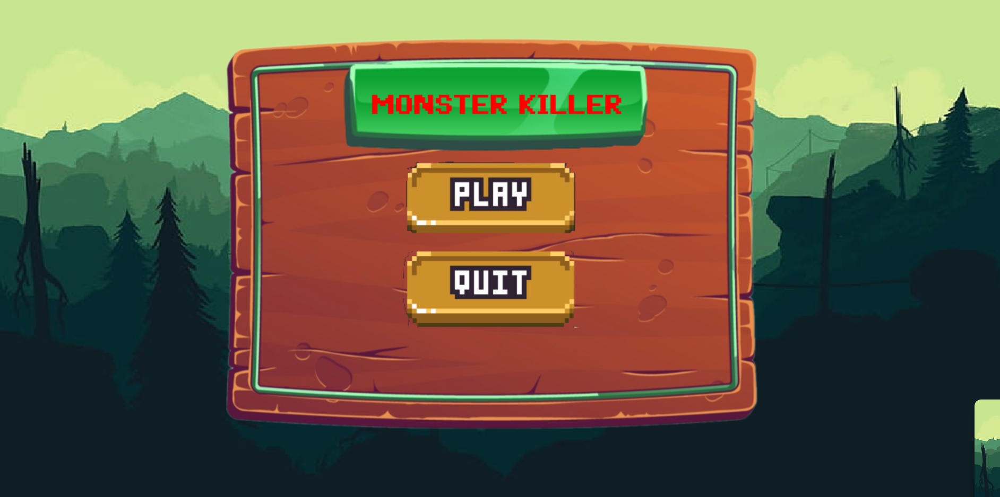
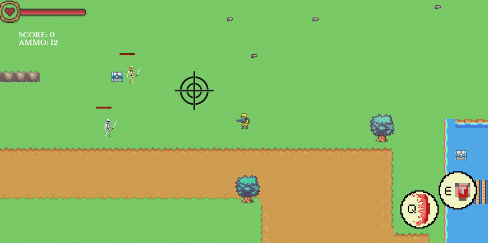
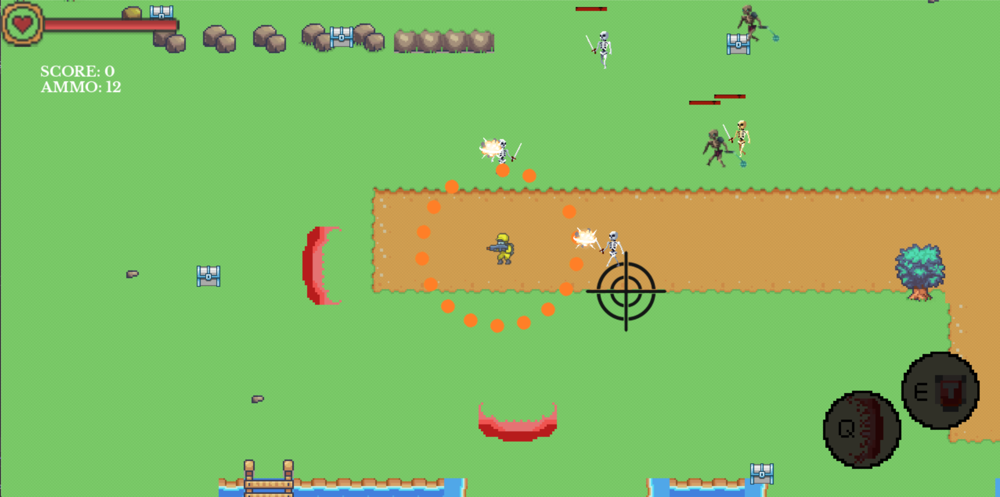

# MONSTER KILLER - A game project made by SDL2 C++
## ***Introduction***:
 - Họ và tên : Vũ Minh Hiến
 - Mã sinh viên : 23020064
 - Lớp học phần : 2324ll_INT2215_50
 - Bài tập lớn : MONSTER KILLER

## ***Description***:

### ***Tổng quan về trò chơi***:
 - Đây là một Game hành động bắn súng được phát triển với nhiều tính năng hay, hấp dẫn được xây dựng bằng ngôn ngữ C++ và thư viện SDL2
 - **Cốt truyện** : Vào năm 2077, con người đã có những đột phá vượt bậc về công nghệ và kỹ thuật , đặc biệt là về lĩnh vực sinh học và con người. Tuy nhiên sự tiến bộ đó cũng tiềm tàng những tham vọng nguy hiểm. The Umbrella- Một công ty dược phẩm ở nước S đã bí mật trái phép nghiên cứu và phát triển vũ khí sinh học và thí nghiệm lên con người, trước khi bị quân đội tiêu diệt đã phát tán một loại virus lạ khiến cho con người biến thành quái vật. Bạn chính là một đặc vụ được chính phủ cử đến khu vực lây nhiễm để điều tra và thu thập thông tin về loại virus đó.
 - Video demo Game:
### ***Các thao tác trong trò chơi***:
| Thao tác | Player |
|----------|--------|
|W| Đi lên|
|S|Đi xuống|
|A|Sang trái|
|D|Sang phải|
|LEFT MOUSE|Bắn súng|
|R|Nạp đạn|
|Q hoặc E|Sử dụng skill|
 - **ESC** : Tạm dừng trò chơi
### ***Preview***:

## ***Cách cài đặt***:
Cách 1. Tải file zip về máy, giải nén . Tìm file .exe trong folder Debug để chạy trò chơi (***lưu ý: để folder trong ổ C: vì project load ảnh bằng đường dẫn tuyệt đối***).

Cách 2. Clone source code về máy .Sử dụng IDE: Visual Studio 2022 để liên kết thư viện và chạy trò chơi. 

Chi tiết về cách liên kết thư viện trên Visual Studio:https://lazyfoo.net/tutorials/SDL/01_hello_SDL/windows/msvc2019/index.php

### ***Các nguồn tham khảo***:
 - Cách sử dụng thư viện, các cú pháp : LazyFoo
 - Cách tổ chức code: kênh youtube Let's Make Games
 - Hình ảnh : pinterest, trang web itch.io
 - Âm thanh : trang web pixabay.com

## **Source code game**:
 - Folder source picture: chứa tất cả source ảnh của trò chơi
 - Folder source ttf: chứa source văn bản
 - Folder source sound: chứa source âm thanh
 - Một số file tương tác chính trong trò chơi
    + *GameControl.h* : Khởi tạo,chạy các thao tác chính trong game( state , xử lí input ).
    + *ObjectTextureManager.h* : xử lí load ảnh và vẽ lên renderer.
    + *GameObject.h* : Lớp đối tượng của trò chơi ( bao gồm các kế thừa Player,Enemy,Boss,Item,Bullet,Aim,Healthbar,Skill...).
    + *State.h* : Các trạng thái chính trong trò chơi ( bao gồm các kế thừa HomeState,Play,Pause,GameOver,Upgrade).
    + *StateManager.h*: Máy chuyển đổi qua lại giữa các State.
    + *InputChecker.h*: Xử lí Input của người chơi (Ấn phím,click chuột).
    + *CollisionChecker.h* : Xử lí va chạm trong trò chơi.
    + *Camera.h* : xử lí di chuyển trong map,đối tượng di chuyển theo camera.
    + *MapObject.h* : xử lí đọc dữ liệu Map từ file .txt để vẽ Map trong trò chơi,xử lí va chạm trong Map.

## **Conclusion**:
### ***Điều tâm đắc***:
 - Dự án do bản thân em tự làm và phát triển, không sao chép code.
 - Hiểu một phần nhỏ trong lập trình hướng đối tượng ( Kế thừa, đa hình,..).
 - Có tìm hiểu Desgin Pattern : Có sử dụng mô hình Singleton trong dự án.
 - Hiếu mô hình vận hành của một trò chơi , cách tổ chức code.
 - Các logic bắn đạn, Skill, random sinh quái là tự bản thân em lên ý tưởng và code.
### ***Một số hạn chế***:
 - Một số class code chưa sạch sẽ, rối.
 - Chưa clear triệt để các con trỏ sau mỗi lần chuyển State.
 - Phần class Camera.h xử lí chưa tốt nên tọa độ bị lệch một chút.

### ***Các định hướng cải thiện,bổ sung***:
 - Thêm nhiều loại card nâng cấp trong game hơn nữa.
 - Thêm các loại weapon và cơ chế đổi weapon.
 - Thêm nhiều loại Skill và nâng cấp Skill.
 - Thêm chế độ Co-op để chơi online với nhau.
 - Thêm loại quái vật và Boss.
 - Thêm màn chơi và thêm các Ending cho trò chơi.
 - Thêm NPC trong game và tương tác với các NPC.

## *Mức điểm mong muốn*:
Vì đây là project đầu tay của bản thân em nên vẫn còn nhiều hạn chế. Em rất mong muốn dự án này được điểm 9.5+ để có động lực phát triển và thực hiện nhiều project hơn trong tương lai.
Em xin trân trọng cảm ơn.

